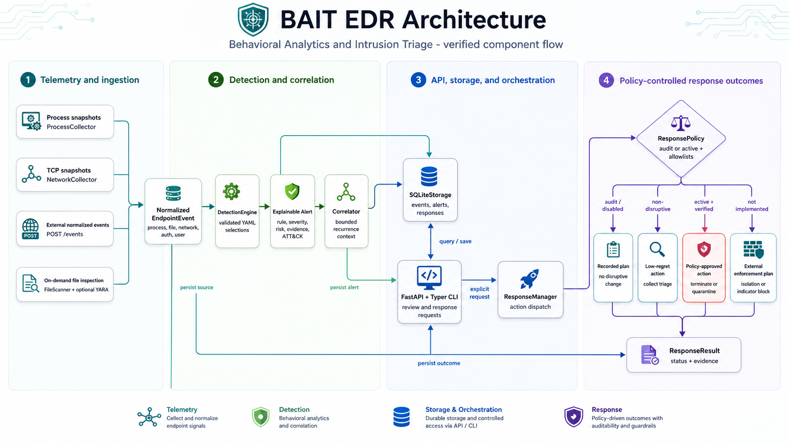
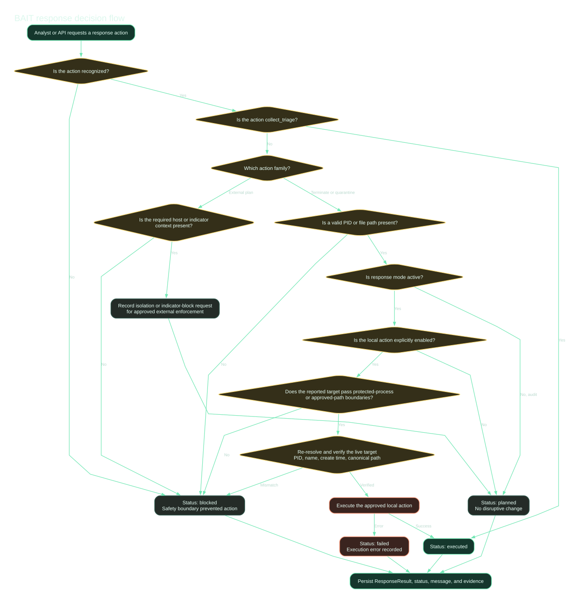

<p align="center">
  
</p>

<p align="center">
  An audit-first endpoint detection and response reference framework for explainable intrusion detection, evidence preservation, and policy-controlled response.
</p>

<p align="center">
  <a href="https://github.com/sunilgentyala/bait-edr/actions/workflows/ci.yml"></a>
  
  
  
  
  <a href="LICENSE"></a>
</p>

> [!IMPORTANT]
> BAIT is a security-focused development preview. It is suitable for research, lab validation, rule development, and controlled pilots. It is not a replacement for a supported enterprise EDR platform.

## Authors

- Primary and corresponding author: Sunil Gentyala
- Secondary author: Suresh Kumar Darisi

## What BAIT does

BAIT collects endpoint observations, normalizes them into a portable event contract, evaluates readable YAML detections, correlates repeated activity, stores evidence, and exposes policy-controlled response actions through a CLI and API.

The framework is intentionally transparent. Every alert retains the event, rule, severity, risk score, ATT&CK mapping, matching explanation, and recommended actions that produced it.

### Engineering principles

1. **Evidence before action:** detections retain the source event and the exact fields that matched.
2. **Audit-first response:** disruptive actions are disabled until an administrator enables active mode and the specific action.
3. **Target verification:** process termination checks PID, process name, and creation time before execution.
4. **Portable telemetry:** events use common process, file, network, user, and authentication objects.
5. **Measurable behavior:** synthetic tests validate rules and response policy without executing malware.

## Verified architecture

<p align="center">
  <a href="docs/assets/architecture-modern.png"></a>
</p>

The diagram maps directly to implemented classes and interfaces. See [FRAMEWORK_REVIEW.md](FRAMEWORK_REVIEW.md) for the component-to-code verification table and unresolved production gaps.

### Current capabilities

- Cross-platform process snapshots with parent-process enrichment through `psutil`
- Established TCP connection snapshots without inventing inbound or outbound direction
- Normalized endpoint event and alert models
- Sigma-inspired YAML rules with schema, operator, condition, ATT&CK tag, and response-action validation
- Five starter detections mapped to relevant ATT&CK techniques
- Stateful SQLite storage for events, alerts, and response results
- Recurrence-based risk correlation
- Safe triage collection
- Policy-gated process termination and file quarantine
- FastAPI ingestion, alert review, and response endpoints
- Typer CLI for local collection, rule validation, demonstration, and API startup
- Optional YARA file inspection
- GitHub Actions CI, CodeQL, Dependabot, and GitHub Pages deployment
- Static documentation site and a sanitized website status widget

## Quick start

### Linux or macOS

```bash
python -m venv .venv
source .venv/bin/activate
python -m pip install --upgrade pip
pip install -e ".[dev]"
cp config.example.yml config.yml
bait validate-rules
bait demo
bait run --once
```

### Windows PowerShell

```powershell
py -m venv .venv
.\.venv\Scripts\Activate.ps1
python -m pip install --upgrade pip
pip install -e ".[dev]"
Copy-Item config.example.yml config.yml
bait validate-rules
bait demo
bait run --once
```

Start the local API:

```bash
bait serve --host 127.0.0.1 --port 8765
```

Open `http://127.0.0.1:8765/docs` for the generated OpenAPI interface.

The safe demonstration submits synthetic PowerShell and TCP connection events. It does not execute a payload or modify the endpoint.

## Detection flow

1. `ProcessCollector`, `NetworkCollector`, or `POST /events` creates an `EndpointEvent`.
2. `DetectionEngine` evaluates validated rule selections.
3. `Correlator` adds bounded recurrence context.
4. `SQLiteStorage` persists the source event and resulting alerts.
5. The API or CLI exposes alerts for review.
6. `ResponseManager` sends explicit response requests through `ResponsePolicy`.
7. Every response produces a stored `ResponseResult` with status and evidence.

### Network direction accuracy

The portable `psutil` API provides established connection snapshots but does not reliably identify which side initiated each connection. BAIT therefore reports `network.direction: unknown` for the portable collector. Native Windows, Linux, and macOS collectors are required before BAIT can claim verified direction.

## Starter detections

| Rule | Detection | Severity | ATT&CK |
|---|---|---:|---|
| `BAIT-1001` | Encoded PowerShell execution | High | T1059.001 |
| `BAIT-1002` | Script interpreter launched by a user-facing application | High | T1204.002, T1059 |
| `BAIT-1003` | Executable launched from a temporary directory | Medium | T1204.002 |
| `BAIT-1004` | TCP connection to an uncommon remote-access port | Medium | T1095 |
| `BAIT-1005` | Multiple authentication failures in an aggregate event | Medium | T1110 |

These rules are starter heuristics. Each requires environment-specific tuning, benign negative tests, and false-positive measurement before production use.

### Rule example

```yaml
- id: BAIT-1001
  title: Suspicious Encoded PowerShell Execution
  description: Detects PowerShell command lines that use encoded command switches.
  severity: high
  tags:
    - attack.execution
    - attack.t1059.001
  logsource:
    category: process_creation
    product: windows
  detection:
    selection:
      event.category: process
      process.name|endswith:
        - powershell.exe
        - pwsh.exe
      process.command_line|regex:
        - "(?:^|\\s)-(?:enc|encodedcommand)(?:\\s|:)"
    condition: selection
  response:
    - collect_triage
    - terminate_process
  false_positives:
    - Approved administrative automation that intentionally uses encoded PowerShell
```

BAIT is inspired by Sigma concepts but is not a complete Sigma implementation. See [STANDARDS.md](STANDARDS.md).

## Response safety

<p align="center">
  
</p>

The default mode is `audit`. In audit mode, BAIT records a planned response but does not terminate a process or move a file.

Active local actions require all of the following:

- `response.mode: active`
- the specific action flag enabled
- a valid target
- a target outside protected process and path boundaries
- target identity verification immediately before execution

Host isolation and indicator blocking remain recorded plans for external enforcement. The core framework does not change host firewall rules.

## Configuration

Copy [config.example.yml](config.example.yml) to `config.yml`. The secure defaults bind the API to localhost and keep active response disabled.

Set an API token before allowing access from another host:

```bash
export BAIT_API_TOKEN="replace-with-a-long-random-secret"
bait serve
```

Do not place tokens in source control or browser JavaScript.

## API surface

| Method | Path | Purpose |
|---|---|---|
| `GET` | `/health` | Basic local health and record counts |
| `GET` | `/alerts` | List stored alerts, bearer token enforced when configured |
| `POST` | `/events` | Ingest a normalized endpoint event |
| `POST` | `/alerts/{alert_id}/respond?action=...` | Request a policy-evaluated response |

Keep the administrative API private until TLS, identity-aware access, RBAC, audit identities, and rate controls are added.

## Repository map

```text
bait_edr/                  Python package
  collectors/              Process and network collectors
  detection/               Rule loading, validation, and matching
  response/                Policy and response actions
rules/                     Built-in detection rules
tests/                     Unit and integration tests
scripts/                   Safe demonstrations and site validation
docs/                      GitHub Pages site, diagrams, and assets
website-integration/       External website widget and proxy examples
.github/                   CI, CodeQL, Pages, issue forms, and Dependabot
```

## Verification

Version 0.2.0 was verified on Python 3.13.5 with:

- 26 passing tests
- 77 percent measured line coverage
- successful Python byte-code compilation
- successful validation of all five built-in rules
- a safe synthetic demonstration producing the two expected alerts
- FastAPI health, authentication, ingestion, alert retrieval, and response checks
- live process and TCP snapshot collection without active response
- successful wheel build and isolated installation with all five packaged rules
- successful Graphviz rendering of all architecture and response diagrams
- static website asset and internal-link validation

See [VERIFICATION.md](VERIFICATION.md) and [test-results](test-results/).

## GitHub Pages and your website

The `docs` directory is ready for GitHub Pages. In the repository, open **Settings > Pages**, choose **GitHub Actions**, and run the included deployment workflow.

The website determines the repository URL automatically when hosted on GitHub Pages. For a different owner or repository name, update the fallback value in `docs/app.js`.

For your existing website, review [website-integration/README.md](website-integration/README.md). Publish only sanitized aggregate status through a server-side endpoint. Never expose the administrative bearer token to the browser.

## Security and governance

Before publishing or deploying:

- enable private vulnerability reporting
- enable Dependabot alerts, secret scanning, push protection, and code scanning
- protect `main` with required CI checks and pull request review
- sign tagged releases and publish checksums
- run a controlled audit-mode pilot
- complete privacy, legal, and operational approval for endpoint telemetry

See [SECURITY.md](SECURITY.md), [THREAT_MODEL.md](THREAT_MODEL.md), [CONTRIBUTING.md](CONTRIBUTING.md), and [CODE_OF_CONDUCT.md](CODE_OF_CONDUCT.md).

## Production gaps

BAIT does not yet provide kernel telemetry, anti-tamper protection, fleet management, TLS termination, multi-tenant authorization, signed rule bundles, enforced retention, or production-certified containment. These limitations are documented rather than hidden.

## Roadmap

1. Native Windows Event Log, ETW, AMSI, and service collectors
2. Linux audit and eBPF collectors
3. macOS Endpoint Security collector
4. Signed rules, configuration, releases, and software bill of materials
5. OCSF export and OpenTelemetry transport
6. Sigma conversion with conformance tests
7. Rule suppressions, allowlists, baselines, and ATT&CK coverage reporting
8. Central fleet management with tenant isolation and delegated administration

## License

Licensed under the [Apache License 2.0](LICENSE).
