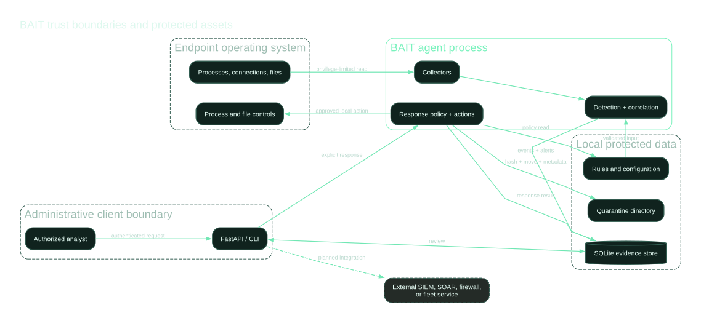

# BAIT Threat Model

**Version:** 0.2.0  
**Review date:** July 25, 2026

## Scope

This threat model covers the local Python agent, portable collectors, normalized events, YAML rules, SQLite storage, API and CLI access, quarantine handling, and policy-controlled response actions.

It does not cover a future fleet control plane, kernel driver, cloud service, native sensor package, software update service, or third-party SIEM and SOAR integration.

## Protected assets

- integrity and provenance of endpoint telemetry
- confidentiality of usernames, paths, command lines, IP addresses, and alert evidence
- integrity of detection rules and response policy
- availability and health of the endpoint agent
- administrator control over disruptive actions
- integrity of quarantine files and metadata
- integrity of response results and audit records

## Trust boundaries

  

1. Endpoint operating system to portable collector
2. Collector or external producer to normalized event model
3. Detection rule contributor to deployed rule bundle
4. Agent process to local SQLite evidence store
5. API or CLI client to BAIT administrative surfaces
6. Response policy to operating-system process and file controls
7. BAIT to future SIEM, SOAR, firewall, and fleet integrations

## Threats and controls

| Threat | Impact | Current control | Residual risk and next control |
|---|---|---|---|
| Tampered or fabricated event | Missed detection or false alert | Pydantic validation, event identifiers, stored triggering evidence | No signed provenance. Add authenticated transport, sensor identity, sequence tracking, and integrity signatures. |
| Telemetry loss | Blind spots for short-lived activity | Collector metadata and explicit snapshot limitations | No loss counter or kernel stream. Add native event sources, health metrics, queue limits, and gap alerts. |
| Malicious rule update | False alerts, bypass, or unsafe response recommendation | Rule schema validation, known action allowlist, unique IDs, CI, code review | No signing or deployment quorum. Add signed bundles, approval workflow, staged rollout, and rollback. |
| Unsafe regular expression | Performance degradation or rule failure | Regex compilation validation | Catastrophic backtracking remains possible. Add complexity limits, execution timeouts, and fuzz tests. |
| API credential theft | Alert disclosure or unauthorized response request | Optional bearer token and localhost default | No TLS, RBAC, short-lived credentials, or identity attribution. Use mTLS or identity-aware proxy and per-user authorization. |
| API denial of service | Agent resource exhaustion | Bounded alert list parameter | No request size, rate, or concurrency control. Add reverse-proxy limits and service resource quotas. |
| PID reuse before termination | Wrong process terminated | Active response verifies process name and creation time immediately before execution | A race remains between final verification and termination. Native handle-based implementation is preferred. |
| Quarantine path escape | Unauthorized file movement | Active mode, explicit approved roots, canonical path recheck | Filesystem races and mount changes remain possible. Use platform-native handles and deny reparse points or symlink traversal. |
| Quarantine tampering | Evidence loss or reintroduction | SHA-256, original path metadata, restricted permissions on non-Windows | No encryption, signing, immutable storage, or restore workflow. Add protected vault storage and signed manifests. |
| Protected process bypass | Business or operating-system disruption | Protected-name list, PID 1 protection, agent PID protection, identity recheck | Name-only policy is insufficient. Add signer, executable path, service identity, and platform policy checks. |
| Database deletion or modification | Evidence loss or falsification | Local persistence and external backup recommendation | No encryption or integrity chain. Add append-only remote storage, signed checkpoints, and backup verification. |
| Sensitive telemetry leakage | Privacy, legal, or compliance impact | Configurable command-line and username capture, private API guidance | Redaction flag and retention setting are not yet enforced. Add field-level redaction, encryption, retention jobs, and access logging. |
| Agent termination | Loss of endpoint visibility | External service supervision recommended | No protected service or tamper event. Add service hardening, watchdog, health reporting, and protected-process design. |
| Supply-chain compromise | Malicious dependency or release | Pinned dependency ranges, CI, CodeQL, Dependabot | No signed release, provenance, or SBOM. Add locked dependencies, attestations, signed artifacts, and dependency review. |
| Website exposes administrative API | Credential and telemetry disclosure | Documentation requires a sanitized server-side proxy | Misconfiguration remains possible. Publish only aggregate fields and enforce CORS, authentication, and rate limits server-side. |

## Abuse cases

### Unauthorized active response

An attacker with API access requests `terminate_process` or `quarantine_file`. The action must still pass response mode, action enablement, target validation, protected boundaries, and immediate identity checks. This reduces impact but does not replace strong API identity and authorization.

### Malicious rule contribution

A contributor adds a broad rule and a disruptive recommendation. CI validates format and known actions, but cannot establish rule quality. Maintainers must require synthetic positive and benign negative tests, false-positive guidance, and manual review.

### Stale event targets

An analyst responds to an old process alert after the original PID has exited and been reused. BAIT compares the current process name and creation time to the alert before termination. A mismatch is blocked.

### Public status widget misuse

A browser widget is pointed directly at the administrative health endpoint. Even without a token, counts and deployment state can disclose operational information. The recommended design is a separate server-side aggregate endpoint containing only approved fields.

## Explicit non-goals for version 0.2.0

- kernel self-protection
- anti-tamper enforcement
- cloud fleet control plane
- malware detonation or exploit execution
- automatic firewall isolation
- autonomous high-impact response
- replacement of enterprise identity, SIEM, SOAR, case management, or incident-response programs

## Review triggers

Update this threat model when adding a native collector, privileged service, update channel, remote control plane, new response action, multi-tenant feature, cloud storage, external integration, or new sensitive telemetry field.
